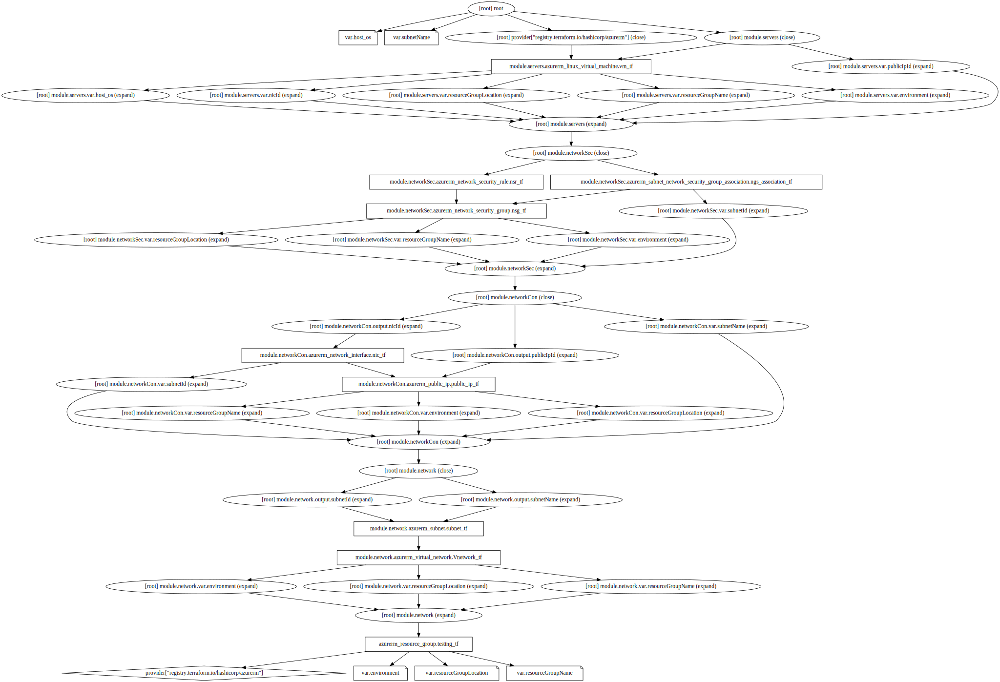

# Deploy Azure VM using terraform

## Description
this project deploys a linux vm (by default) running nginx on docker

## useful commands
To deploy this project run

```bash
  terraform init
```

```bash
  terraform plan
```

```bash
  terraform apply
``` 

Commands you might need

```bash
  terraform output
``` 

```bash
  terraform state list
``` 


dependency graph generated using Graphviz library:
